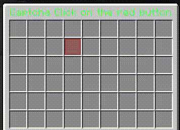
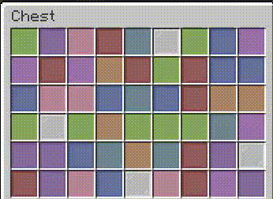

# SInventory

A libary to easily create minecraft inventory plugins in spigot/paper.


## Demo

#### Captcha

```java
public class Captcha extends SInventoryInstance {

    public SInventoryState<Integer> directionX = new SInventoryState<>(1);
    public SInventoryState<Integer> directionY = new SInventoryState<>(1);

    public SInventoryState<Integer> locationX = new SInventoryState<>(1);
    public SInventoryState<Integer> locationY = new SInventoryState<>(1);

    public Captcha(){
        setTitle("§l§aCaptcha Click on the red button");
        setClickable(false);

        runTaskTimerAsync(()->{
            int nextX = locationX.get() + directionX.get();
            int nextY = locationY.get() + directionY.get();
            int directX = directionX.get();
            int directY = directionY.get();
            if(nextX < 0 || nextX > 8) {
                directX *= -1;
            }
            if(nextY < 0 || nextY > rows-1) {
                directY *= -1;
            }
            nextX = locationX.get() + directX;
            nextY = locationY.get() + directY;
            directionX.setNoExecuteEvent(directX);
            directionY.setNoExecuteEvent(directY);
            locationX.setNoExecuteEvent(nextX);
            locationY.setNoExecuteEvent(nextY);
            invokeRender();
        }, 1, 1);
    }

    @Override
    public void onClick(InventoryClickEvent event, SInventoryPosition relativePosition) {
        Bukkit.broadcastMessage("click!");
    }

    @Override
    public VRender render(VRender render) {
        render.set(locationX.get(), locationY.get(), new ItemStack(Material.RED_STAINED_GLASS_PANE));
        return render;
    }
}
```
#### Rainbow menu

```java
public class RainbowMenu extends SInventoryInstance {

    public SInventoryState<Integer> randomSeed = new SInventoryState<>(1);
    Material[] materials = new Material[]{
            Material.BLUE_STAINED_GLASS_PANE,
            Material.RED_STAINED_GLASS_PANE,
            Material.LIME_STAINED_GLASS_PANE,
            Material.PINK_STAINED_GLASS_PANE,
            Material.CYAN_STAINED_GLASS_PANE,
            Material.WHITE_STAINED_GLASS_PANE,
            Material.PURPLE_STAINED_GLASS_PANE,
            Material.ORANGE_STAINED_GLASS_PANE,
            Material.MAGENTA_STAINED_GLASS_PANE,
    };

    public RainbowMenu(){
        runTaskTimerAsync(()->{
            randomSeed.set(new Random().nextInt());
        }, 0, 0);
    }

    @Override
    public VRender render(VRender render) {
        Random r = new Random(randomSeed.get());
        for(int x = 0; x < 9; x++){
            for(int y = 0; y < 6; y++){
                render.set(x, y, new ItemStack(materials[r.nextInt(materials.length)]));
            }
        }
        return render;
    }
}

```